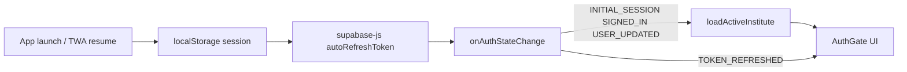

# Vidyafee TWA Production Readiness Audit

| Field | Value |
| --- | --- |
| Date | 2026-08-20 |
| App path | `smart-tuition-cloud/` |
| Stack (actual) | **TanStack Start + Vite 8 + React 19 + Supabase** (not Next.js) |
| Method | Static code review, RLS migration spot-check, critical-flow walkthrough, `npm run build` |
| Scope | Findings only — no code fixes in this pass |
| TODO cutoff | Flag markers older than **2026-05-20** (none found in `src/`) |

Severity rubric:

- **Blocker** — blocks safe production / TWA packaging, data exposure, or a critical phone flow
- **Should-fix** — daily mobile/TWA friction, silent failures, security gaps that matter under real use
- **Nice-to-have** — polish, dead code, console noise, bundle trim

---

## Blockers

### B1: No Web App Manifest / TWA packaging assets

- **Finding:** There is no `manifest.webmanifest` / `manifest.json`, no service worker, no `assetlinks.json`, and `public/` only contains `robots.txt`. Bubblewrap / Trusted Web Activity packaging requires a installable web app manifest (name, icons, `display`, `start_url`, `theme_color`) and Digital Asset Links for verified Android association.
- **Why it blocks:** You cannot ship a production TWA from this repo as-is without adding those assets and hosting `/.well-known/assetlinks.json` on the live origin.
- **Evidence:** `public/` inventory; no matches for `manifest` / Workbox / Bubblewrap in the app tree. Viewport meta exists in [`src/routes/__root.tsx`](../src/routes/__root.tsx) line 84 only.
- **Suggested fix direction:** Add PWA manifest + icons + `assetlinks.json` for the production domain before Bubblewrap.

### B2: Production messaging migrations still pending apply

- **Finding:** Messaging templates / `comm_logs` are implemented in code, but [`KNOWN_ISSUES.md`](../KNOWN_ISSUES.md) states migrations `20260814000000_message_templates_and_comm_logs.sql` and `20260814230000_follow_up_threshold.sql` are **not yet applied to production**. Until then, template edits and comm history will not persist reliably across devices (TWA on phone vs browser).
- **Why it blocks:** WhatsApp is a core daily flow on Android; cross-device persistence and audit of sends is part of that flow.
- **Evidence:** [`KNOWN_ISSUES.md`](../KNOWN_ISSUES.md) lines 262–276 and 351–358; migration file [`supabase/migrations/20260814000000_message_templates_and_comm_logs.sql`](../supabase/migrations/20260814000000_message_templates_and_comm_logs.sql).
- **Suggested fix direction:** `supabase db push` (or equivalent) to production and verify `authenticated` vs `anon` grants via `information_schema` before TWA launch.

### B3: Bulk WhatsApp reminders rely on staggered `window.open` (fails inside TWA / Android WebView)

- **Finding:** Bulk recovery opens many WhatsApp tabs via staggered `window.open`. Comments already admit only the first reliably opens in most browsers; inside a TWA this is worse (Chrome Custom Tabs / intent handling, popup blocking).
- **Why it blocks:** Bulk fee recovery is a named critical flow; teachers will think messages “queued” when most never open.
- **Evidence:**
  - [`src/lib/messaging/whatsapp.ts`](../src/lib/messaging/whatsapp.ts) lines 74–76 (`window.open(..., "_blank", ...)`)
  - [`src/routes/recovery.tsx`](../src/routes/recovery.tsx) lines 497–512 (stagger + toast “queued — confirm each WhatsApp tab”)
  - Contrast: [`src/components/attendance/notify-absentees-dialog.tsx`](../src/components/attendance/notify-absentees-dialog.tsx) lines 28–29 correctly rejects bulk `window.open`
- **Suggested fix direction:** One-at-a-time send UX (like attendance notify) or `wa.me` intent/`location.assign` single-target flow; never multi-`window.open`.

---

## Should-fix

### S1: `.env` is git-tracked and `.gitignore` omits `.env`

- **Finding:** Root `.env` is tracked (`git ls-files .env` → `.env`). [`.gitignore`](../.gitignore) has **no** `.env` rule. Keys present (names only): `SUPABASE_*` / `VITE_SUPABASE_*` publishable URL + key — **no** `SUPABASE_SERVICE_ROLE_KEY` in this file. Still unsafe: publishable keys + project id leak into history; future secret additions are easy to commit by mistake.
- **Evidence:** `.gitignore` lines 1–31; `git ls-files .env`; env key names listed without values.
- **Suggested fix direction:** Add `.env` to `.gitignore`, rotate publishable key if repo is/was public, keep only `.env.example` with placeholders.

### S2: `is_member()` RLS ignores `access_enabled` / membership `status`

- **Finding:** Client AuthGate correctly shows “disabled” when `access_enabled` is false ([`session.ts`](../src/lib/auth/session.ts) lines 111–117), but Postgres `is_member()` only checks that a membership row exists for `(institute_id, user_id)` — not `access_enabled` or `status = 'active'`. A disabled member who still has a valid JWT can call Supabase APIs / RPCs under RLS.
- **Evidence:** [`supabase/migrations/20260703064918_179279b9-11b4-4121-8faa-e860818357f3.sql`](../supabase/migrations/20260703064918_179279b9-11b4-4121-8faa-e860818357f3.sql) lines 52–57; no later migration replaces `is_member`. Client gate: [`session.ts`](../src/lib/auth/session.ts) 111–117.
- **Suggested fix direction:** Update `is_member` (and related helpers) to require `access_enabled` and active status; re-test team disable flow at the API layer.

### S3: Anon key cannot read tenant data (good) — but verify all RPCs stay revoked

- **Finding (positive with residual risk):** Table policies are `TO authenticated` + `is_member(institute_id, …)`. Migrations revoke `PUBLIC`/`anon` on newer tables/RPCs (attendance, expenses, messaging). Spot-check: anon alone cannot SELECT students/payments via RLS. Residual: any new RPC without the same `REVOKE` pattern would be dangerous (repo already documents this lesson).
- **Evidence:** Core policies in [`20260703064918_…sql`](../supabase/migrations/20260703064918_179279b9-11b4-4121-8faa-e860818357f3.sql) (students/payments ~214–264); revokes in attendance/expenses/messaging migrations.
- **Suggested fix direction:** Keep the “REVOKE in same migration + `information_schema` verify” rule for every new RPC; optional CI check.

### S4: Session survives backgrounding via Supabase defaults — no resume hardening for Android

- **Finding:** Client uses `persistSession: true`, `autoRefreshToken: true`, `localStorage` ([`client.ts`](../src/integrations/supabase/client.ts) 50–54). `onAuthStateChange` handles `TOKEN_REFRESHED` without full reload ([`session.ts`](../src/lib/auth/session.ts) 230–242). There is **no** `visibilitychange` / `pageshow` handler to force `getSession()` / soft revalidation after long Android backgrounding. Usually OK; edge cases (WebView process kill, clock skew, expired refresh) may strand the UI until hard reload.
- **Evidence:** files above; no `visibilitychange` / `document.hidden` usage in `src/`.
- **Suggested fix direction:** On `visibilitychange` → visible, call `supabase.auth.getSession()` and optionally React Query `invalidateQueries` for critical lists.

### S5: Attendance grid has no loading / error UI while session data fetches

- **Finding:** `attendanceQuery` uses `useQuery` but the tab never reads `isLoading` / `isError` / `isFetching`. Grid can flash empty “everyone present” before hydrate, or silently stay empty on network failure (save path toasts; load path does not).
- **Evidence:** [`src/routes/attendance.tsx`](../src/routes/attendance.tsx) lines 157–172, 332–340; grep shows no `isLoading`/`isFetching` in that file.
- **Suggested fix direction:** Skeleton / spinner while pending; toast or inline error on `isError`.

### S6: Record Payment dialog — solid validation, small touch/close targets

- **Finding:** Validation, duplicate ack, submitting guard, and toasts are good ([`record-payment-dialog.tsx`](../src/components/record-payment-dialog.tsx) 105–172). Dialog uses `max-h-[90vh] overflow-y-auto` (184) — OK on phones. Shared dialog close control is a tiny `h-4 w-4` icon hit area ([`ui/dialog.tsx`](../src/components/ui/dialog.tsx) 47–49). Payment row kebab is `h-7 w-7` (28×28 CSS px) — under 44×44 ([`payment-row-menu.tsx`](../src/components/payment-row-menu.tsx) 81).
- **Suggested fix direction:** Enlarge dialog close + payment menu triggers to ≥44×44 (student menu already uses `h-11 w-11` at [`student-row-menu.tsx`](../src/components/student-row-menu.tsx) 60).

### S7: Bulk Student Import preview table will horizontal-scroll / crowd &lt;400px

- **Finding:** Import dialog is `max-w-3xl` with a 6-column preview `Table` inside `ScrollArea` — workable but cramped on narrow phones; upload dropzone is fine. `xlsx` is a **static** import into the dialog, and batches route statically imports the dialog → pulls ~xlsx into the batches chunk (see build).
- **Evidence:** [`import-students-dialog.tsx`](../src/components/import-students-dialog.tsx) lines 4, 578, 639–674; [`batches.tsx`](../src/routes/batches.tsx) line 29.
- **Suggested fix direction:** Mobile card list for preview rows; `React.lazy` / dynamic `import()` for the dialog (and keep `xlsx` inside it).

### S8: Students / receipts filter bars force wide min-widths

- **Finding:** Search + selects use `min-w-[220px]`, `w-[200px]`, `w-[160px]` in a wrapping flex — on ~360–400px widths this stacks awkwardly and can feel like horizontal overflow when combined with padding.
- **Evidence:** [`students.index.tsx`](../src/routes/students.index.tsx) 95–117; [`receipts.index.tsx`](../src/routes/receipts.index.tsx) 56.
- **Suggested fix direction:** Full-width controls under `sm:` breakpoint (`w-full min-w-0`).

### S9: Silent / console-only failures on some settings & team paths

- **Finding:** Several paths log `console.error` without user-facing toast:
  - [`settings/store.ts`](../src/lib/settings/store.ts) 247–266 (`addMasterValue` / `removeMasterValue` / `nextReceiptNumber` `.catch(console.error)`)
  - [`team/store.ts`](../src/lib/team/store.ts) ~52
  - [`team-members-section.tsx`](../src/components/settings/team-members-section.tsx) 152, 165, 262
  - [`adapter.ts`](../src/lib/data/adapter.ts) 296, 425 (reconcile / batch fee sync — background, easy to miss)
- **Suggested fix direction:** Surface toasts (or revert + toast) on user-initiated settings/team mutations; keep console for true background reconcile only if you also show a soft banner.

### S10: Route-level error UI is root-only

- **Finding:** Only root `errorComponent` / `notFoundComponent` in [`__root.tsx`](../src/routes/__root.tsx) 20–78. No per-route error boundaries. Acceptable for a small app; a crash in one feature still replaces the whole shell.
- **Suggested fix direction:** Optional per-route `errorComponent` on heavy routes (attendance, fees, expenses).

### S11: Eager heavy chunks (build warning)

- **Finding:** Vite warns chunks &gt; 500 kB. Notable client assets:
  - `exceljs.min-*.js` ~930 kB (256 kB gzip) — reports (dynamic import: good)
  - `batches-*.js` ~468 kB (154 kB gzip) — includes bulk import / `xlsx`
  - `lists-*.js` ~407 kB — shared data layer
  - `jspdf` ~400 kB, `BarChart`/recharts ~370 kB, `html2canvas` ~200 kB×2
- **Evidence:** `npm run build` output 2026-08-20 (see Bundle notes below).
- **Suggested fix direction:** Lazy-load ImportStudentsDialog and chart/PDF entry points from dashboard/batches; avoid dual html2canvas if both can share one.

### S12: WhatsApp send logging inconsistent

- **Finding:** Fees / recovery / attendance notify / payment-row-menu call `logComm`. Receipt page, student detail, and dashboard WhatsApp opens do **not** (prior explore + code paths via `openWhatsApp` without `logComm`).
- **Suggested fix direction:** Always wrap user-facing WA opens with `logComm` for audit parity on phone.

### S13: Service-role client scaffolding unused (safe today)

- **Finding:** [`client.server.ts`](../src/integrations/supabase/client.server.ts) 34–69 exports `supabaseAdmin` with `SUPABASE_SERVICE_ROLE_KEY`. No app `src` import uses it (only self-definition). `requireSupabaseAuth` middleware also unused. Risk is future accidental client import of admin client.
- **Suggested fix direction:** Keep server-only; add lint boundary or delete unused scaffolding until needed.

---

## Nice-to-have

### N1: No `console.log` debug noise in `src/`

- **Finding:** Zero `console.log` in app source. Remaining `console.error` (~22) are error-path logs (see S9). No `TODO`/`FIXME`/`HACK` in `src/` after 2026-05-20 cutoff.
- **Evidence:** repo grep 2026-08-20.

### N2: Unused auth middleware / admin client

- Dead scaffolding noted in S13 — cleanup when convenient.

### N3: Dialog / sheet close buttons and checkbox / switch sizes

- Shared UI primitives use small hit targets (`dialog` close ~16px icon; `checkbox` `h-4 w-4`; `switch` `h-5`). Student row menu already fixed to 44px — extend pattern app-wide.

### N4: Sidebar menu-action hover-only opacity

- [`ui/sidebar.tsx`](../src/components/ui/sidebar.tsx) ~616: `md:opacity-0` until hover/focus — on touch, rely on `group-focus-within` / always-visible actions on mobile.

### N5: Admission form `w-[794px]` is off-screen (not a viewport bug)

- [`students.$id.tsx`](../src/routes/students.$id.tsx) 154–155 uses fixed A4-ish width inside `fixed -left-[9999px]` for PDF snapshot — intentional; do not treat as mobile overflow.

### N6: Raw `` for logos

- [`receipts.$id.tsx`](../src/routes/receipts.$id.tsx) ~127; [`settings.tsx`](../src/routes/settings.tsx) ~111. Fine for small logos; ensure uploads are size-capped (no large static assets found in `public/`).

### N7: Missing `.env.example` at app root

- Setup docs exist; an `.env.example` would reduce onboarding mistakes once `.env` is untracked.

---

## Critical flow notes

### Attendance marking — mostly ready; load UX gap

| Aspect | Verdict |
| --- | --- |
| Mark / save | Good — optimistic toggle, debounce, sticky save bar, toasts, lock rules ([`attendance.tsx`](../src/routes/attendance.tsx) 174–248, 344–371) |
| Touch | Good — grid chips `min-h-[44px]` ([`attendance-grid.tsx`](../src/components/attendance/attendance-grid.tsx) 45) |
| Load / error | **Gap** — no loading/error UI for `attendanceQuery` (S5) |
| Notify after save | Good — one-at-a-time dialog (avoids bulk `window.open`) |
| TWA | Save path OK; WhatsApp notify still uses `window.open` once per send (acceptable if Custom Tabs work; test on device) |

### Record Payment — ready with touch polish

| Aspect | Verdict |
| --- | --- |
| Validation / errors | Good — date, amount clamps, duplicate ack, try/catch + toast (S6) |
| Mobile dialog | Acceptable scroll (`max-h-[90vh]`) |
| Touch | Enlarge close + row menus (S6) |
| TWA | Navigates to receipt via router — fine |

### Bulk Student Import — functional; mobile preview + bundle cost

| Aspect | Verdict |
| --- | --- |
| Stages / progress / cancel | Good ([`import-students-dialog.tsx`](../src/components/import-students-dialog.tsx) 435–529, 685–695) |
| Validation feedback | Good — preview badges + failed CSV |
| Mobile | Preview table cramped (S7) |
| Failures | User toasts; payment partial failure warned (522–528); parse errors toast + `console.error` (403–406) |
| Bundle | Static `xlsx` via batches route (S11) |

### WhatsApp notifications — product OK; TWA bulk is broken

| Trigger | Logs `comm`? | Mechanism |
| --- | --- | --- |
| Attendance notify dialog / tab / day list | Yes | Single `openWhatsApp` |
| Fees / recovery row | Yes | Single open |
| Bulk recovery | Yes (fires for all) | **Staggered `window.open` — Blocker B3** |
| Receipt / student detail / dashboard | Often **No** | Single open (S12) |

All paths are client `https://wa.me/...` — teacher confirms send in WhatsApp. No server WhatsApp API.

---

## Auth / session summary (TWA resume)

- Persist + auto-refresh: **present** ([`client.ts`](../src/integrations/supabase/client.ts) 50–54).
- Resume-specific hardening: **missing** (S4).
- Hardcoded browser redirects: **none** for auth; only WhatsApp `window.open` and Lovable error `pathname` read.

---

## Env & secrets summary

| Item | Status |
| --- | --- |
| Client key | Publishable / `VITE_SUPABASE_PUBLISHABLE_KEY` only in browser client |
| Service role in client bundles | Not referenced by app routes; server helper unused |
| `.env` in git | **Yes — Should-fix S1** |
| RLS tenant isolation | Policies use `is_member`; anon revoked on audited objects — **S2** gap on disabled members |

---

## Build / bundle notes

Command: `npm run build` (Vite 8.1.4) — **succeeded** with chunk-size warning.

Largest **client** chunks (minified):

| Asset | ≈ Size | ≈ gzip |
| --- | ---: | ---: |
| `exceljs.min-*.js` | 930 kB | 256 kB |
| `batches-*.js` | 468 kB | 154 kB |
| `lists-*.js` | 407 kB | 116 kB |
| `jspdf.es.min-*.js` | 400 kB | 130 kB |
| `BarChart-*.js` (recharts) | 370 kB | 98 kB |
| `index-*.js` | 366 kB | 112 kB |
| `html2canvas-pro*.js` | 208 kB | 50 kB |
| `html2canvas-*.js` | 200 kB | 47 kB |
| `expenses-*.js` | 63 kB | 15 kB |
| `attendance-*.js` | 29 kB | 9 kB |

Reporter message: *“Some chunks are larger than 500 kB after minification”* — primarily exceljs; batches also near threshold due to import/xlsx.

---

## Recommended fix order (for your review — not implemented)

1. **B2** Apply pending Supabase migrations to production  
2. **B1** Add manifest + icons + Digital Asset Links  
3. **B3** Replace bulk `window.open` with sequential send UX  
4. **S1** Untrack `.env` / gitignore / rotate if needed  
5. **S2** Tighten `is_member` for `access_enabled`  
6. **S5–S8, S11** Mobile/loading/bundle polish on daily paths  
7. Nice-to-haves as time allows  

Reply with the finding IDs you want implemented first (e.g. `B1 B3 S5`), and we will fix those step-by-step only.

---

## Remediation status (2026-08-20)

| ID | Status |
| --- | --- |
| B1 | Done in repo — manifest, icons, assetlinks placeholder, `docs/TWA-SETUP.md` |
| B2 | Migration files ready; **you must** run `supabase db push` on production (CLI not available in this environment) |
| B3 | Done — sequential Send & next bulk reminders |
| S1 | Done — `.gitignore` + `.env.example`; `.env` removed from git index |
| S2 | Done — migration `20260820120000_is_member_requires_active_access.sql` |
| S3 | Done — `scripts/verify-rls-grants.sql` |
| S4 | Done — visibility/pageshow/focus resume handlers |
| S5 | Done — attendance loading/error UI |
| S6–N3 | Done — 44px dialog/sheet close, payment/team menus, larger checkbox/switch |
| S7/S11 | Done — mobile import cards; lazy import dialog + dynamic `xlsx`; lazy dashboard charts |
| S8 | Done — full-width filters on students/receipts |
| S9 | Done — toasts on settings master list / team load |
| S10 | Done — route errorComponent on attendance/fees/expenses/batches |
| S12 | Done — `logComm` on dashboard/receipt/student WA |
| S13/N2 | Done — removed unused admin client + auth middleware |
| N4 | Done — sidebar actions visible on mobile |
| N7 | Done — `.env.example` |

**Still manual:** fill `assetlinks.json` package/SHA after Android signing; apply DB migrations to production; rotate publishable key if `.env` was ever public.
