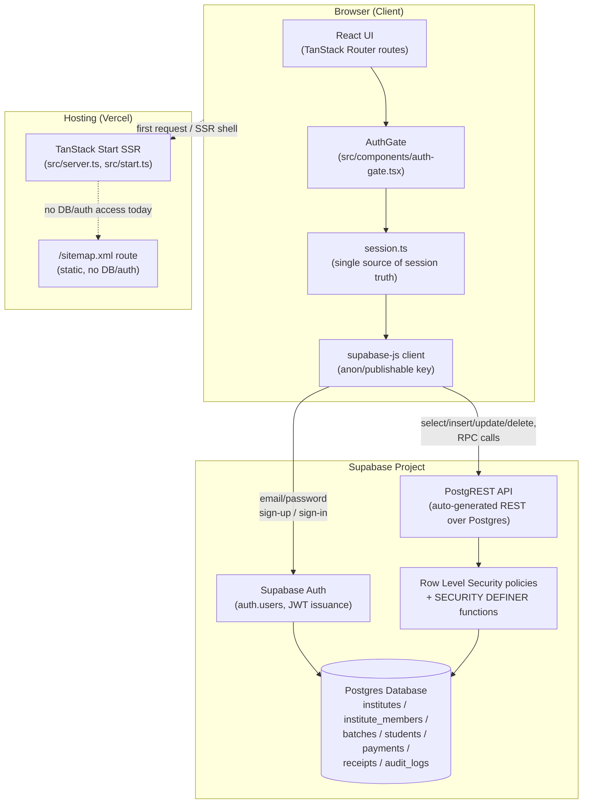

# Backend & Authentication Architecture

> **Scope of this document:** this is a read-only audit. Nothing in this file
> changes application behavior. It documents what the code and configuration
> already do, as of commit `e9a6079`.

---

## Table of contents

1. [Where the backend is](#1-where-the-backend-is)
2. [Supabase configuration](#2-supabase-configuration)
3. [Authentication](#3-authentication)
4. [Institute owner / staff accounts](#4-institute-owner--staff-accounts)
5. [Database schema](#5-database-schema)
6. [Backend functions (RPCs, triggers, server code)](#6-backend-functions-rpcs-triggers-server-code)
7. [Architecture overview](#7-architecture-overview)
8. [How to access the backend](#8-how-to-access-the-backend)
9. [Final report](#9-final-report)

---

## 1. Where the backend is

**This app has no custom backend server.** It's a TanStack Start (React SSR)
frontend that talks **directly to Supabase** from the browser. There is no
separate Node/Express/Fastify API, no tRPC, no GraphQL, no REST API of its
own.

Evidence, from a full-repo search:

| Searched for | Found | Where |
|---|---|---|
| `supabase` | Yes — this **is** the backend | `src/integrations/supabase/*`, `supabase/migrations/*` |
| `postgres` | Yes, indirectly | Supabase's database *is* Postgres (all `.sql` migrations are plain Postgres DDL) |
| `createServerFn` (TanStack Start server functions) | **None found** | No file in `src/` defines a server function |
| `fetch(` | Only inside the Supabase client wrappers, to call Supabase's own REST/Auth API | `client.ts`, `client.server.ts`, `auth-middleware.ts` |
| `axios` | Not used | — |
| `trpc` | Not used | — |
| `graphql` | Not used | — |
| Edge Functions (`supabase/functions/`) | **None exist** | No `supabase/functions` directory in the repo |
| `routes/api` / custom API routes | One route handler exists, but it's a static XML sitemap generator, not an API: `src/routes/sitemap[.]xml.ts` | Not related to app data or auth |
| `server` | `src/server.ts` / `src/start.ts` exist, but only wire up global error handling and a middleware that attaches the user's bearer token to any future server function — see [§6](#6-backend-functions-rpcs-triggers-server-code) | — |

**Conclusion:** the backend is **Supabase** (Postgres + Supabase Auth + PostgREST),
called directly from client-side React code. All data access rules are
enforced by **Postgres Row Level Security (RLS)**, not by application code.
TanStack Start's SSR is used only for rendering pages and one static route
(the sitemap) — it does not currently mediate any data or auth requests.

---

## 2. Supabase configuration

### Where it lives

| File | Purpose |
|---|---|
| `src/integrations/supabase/client.ts` | Browser Supabase client (anon/publishable key). Used by almost all app code. |
| `src/integrations/supabase/client.server.ts` | Server-only Supabase client using the **service role key** (bypasses RLS). Currently defined but **not imported/used anywhere** in the app — it's available scaffolding, not active code. |
| `src/integrations/supabase/auth-middleware.ts` | A TanStack Start server-function middleware (`requireSupabaseAuth`) that validates a bearer token server-side. Defined but **not currently attached to any server function**, because the app has no server functions yet. |
| `src/integrations/supabase/auth-attacher.ts` | A TanStack Start client-side middleware (`attachSupabaseAuth`) that would attach the browser's access token to any server-function call. Registered globally in `src/start.ts`, but has nothing to attach to yet (no server functions exist). |
| `src/integrations/supabase/types.ts` | Generated TypeScript types for every table/RPC (kept in sync with the schema in `supabase/migrations/`). |
| `supabase/config.toml` | Contains only the Supabase **project ID** (`xrkfbsupszhsjevcmntc`) — this is how the Supabase CLI knows which cloud project a local `supabase db push` etc. targets. |
| `supabase/migrations/*.sql` | The entire database schema, as version-controlled SQL migrations (see [§5](#5-database-schema)). |
| `.env` (repo root) | **⚠️ See security note below.** |

### Required environment variables

| Variable | Used by | Sensitivity |
|---|---|---|
| `VITE_SUPABASE_URL` / `SUPABASE_URL` | Browser client, server middleware | Public — safe to expose client-side |
| `VITE_SUPABASE_PUBLISHABLE_KEY` / `SUPABASE_PUBLISHABLE_KEY` | Browser client, server middleware | Public (anon key) — safe to expose client-side, access is restricted entirely by RLS |
| `SUPABASE_SERVICE_ROLE_KEY` | `client.server.ts` only | **Secret** — bypasses RLS entirely, must never reach the browser bundle |
| `VITE_SUPABASE_PROJECT_ID` / `SUPABASE_PROJECT_ID` | Not directly read by app code; informational / used by tooling | Public |

The `VITE_*` variants are read via `import.meta.env` (available in the browser
bundle, inlined at build time by Vite). The non-`VITE_*` variants are read via
`process.env` (server-side only, e.g. in `client.server.ts` and
`auth-middleware.ts`, which never ship to the browser).

### ⚠️ Security note — `.env` is committed to this repository

`.env` at the repo root **is tracked by git** (it is not listed in
`.gitignore`) and currently contains real values for:

```
SUPABASE_PROJECT_ID
SUPABASE_PUBLISHABLE_KEY
SUPABASE_URL
VITE_SUPABASE_PROJECT_ID
VITE_SUPABASE_PUBLISHABLE_KEY
VITE_SUPABASE_URL
```

This is **lower severity than it looks**: every one of these is a value
Supabase's own docs consider safe to expose client-side (the anon/publishable
key's access is entirely governed by RLS, and the project URL is public by
definition — anyone using the deployed app already receives these same values
in their browser's network tab). It is **not** the service-role key, and no
`SUPABASE_SERVICE_ROLE_KEY` appears anywhere in the repository.

That said, the normal convention is to keep `.env` out of version control
(commit an `.env.example` with empty/placeholder values instead) so that
rotating a key doesn't require a code change, and so secrets *added later*
don't accidentally end up committed by the same habit. No `.env.example` file
currently exists in the repo. **No code changes were made for this as part of
this audit** — flagging it here for a decision, not fixing it, per this
task's scope.

---

## 3. Authentication

### Provider

**Supabase Auth**, using its built-in **email + password** flow
(`supabase.auth.signUp`, `supabase.auth.signInWithPassword`). There is no
external identity provider (no Google/GitHub/etc. OAuth configured) as of the
current commit — an earlier version of this app used Google OAuth via a
third-party broker (`@lovable.dev/cloud-auth-js`) and later Supabase's native
Google OAuth, both of which were replaced with email/password (see git log
for `src/components/auth-gate.tsx`).

- **Users are stored in Supabase's built-in `auth.users` table** (managed
  entirely by Supabase Auth — not a custom table).
- There is **no custom `profiles` table**. Anything institute/role-specific
  lives in `public.institute_members` (see [§4](#4-institute-owner--staff-accounts)),
  which references `auth.users(id)` by foreign key.
- Session tokens (JWT access + refresh token) are persisted in the browser's
  `localStorage` by the Supabase client (`persistSession: true`,
  `autoRefreshToken: true` in `client.ts`), which is what allows a page
  refresh to keep the user logged in without any custom code.

### Complete login flow

```
Login page (SignInScreen, src/components/auth-gate.tsx)
    │
    │  user submits email + password
    ▼
supabase.auth.signInWithPassword({ email, password })
  (or supabase.auth.signUp(...) for a new account)
    │
    │  Supabase Auth validates credentials, issues a JWT session,
    │  and supabase-js persists it to localStorage
    ▼
supabase.auth.onAuthStateChange fires "SIGNED_IN"
  (subscribed once, in src/lib/auth/session.ts → initAuth())
    │
    ▼
loadActiveInstitute(userId)                         [src/lib/auth/session.ts]
    │
    │  SELECT institute_id, role, access_enabled
    │  FROM institute_members WHERE user_id = <current user>
    │  (RLS-scoped: a user can only ever see their own membership rows)
    ▼
  ┌─────────────────────────────────────────────────────────────┐
  │ No membership row?        → status = "no-institute"          │
  │                              → CreateInstituteScreen shown    │
  │                                                                │
  │ Membership found, but                                        │
  │ access_enabled = false?   → status = "disabled"               │
  │                              → "Account disabled" screen       │
  │                                                                │
  │ Membership found,                                            │
  │ institute.subscription_status = 'expired'/'blocked'?          │
  │                            → status = "expired" / "blocked"   │
  │                              → subscription status screen      │
  │                                                                │
  │ Otherwise                 → status = "ready"                  │
  └─────────────────────────────────────────────────────────────┘
    │
    ▼
AuthGate (src/components/auth-gate.tsx) renders <Outlet /> instead of any
of the screens above → the actual app (dashboard, students, fees, etc.)
becomes visible.
```

There is no separate "role check" step or "dashboard redirect" as distinct
stages — `AuthGate` wraps the entire route tree in `src/routes/__root.tsx`
and conditionally renders either a full-screen auth/onboarding/status screen
or the real app (`<Outlet />`), based purely on the `SessionState.status`
value computed above. Nothing does a client-side URL redirect for auth
purposes; the same URL just renders different content depending on session
state. This avoids an entire class of redirect-loop bugs.

### Role check

"Role" (`owner` vs `staff`) is read directly off the `institute_members` row
found above and stored in `SessionState.role`. It currently isn't used to
gate any specific page — the codebase gives every member of an institute
(owner or staff) the same dashboard access; only owner-only actions (e.g.
adding a member, editing institute settings) would need to check
`session.role === "owner"` (worth verifying per-feature if stricter role
separation is desired later).

---

## 4. Institute owner / staff accounts

- **Accounts are created via self-service sign-up** — anyone can create a
  Supabase Auth account through the sign-in screen (`supabase.auth.signUp`).
  There is no invite-only or admin-provisioning flow currently.
- **The first person to sign up and create an institute becomes its
  `owner`** automatically, via a database trigger
  (`add_creator_as_owner()`, fired `AFTER INSERT ON institutes`) that inserts
  a row into `institute_members` with `role = 'owner'`.
- **Additional staff accounts** would need to be added as rows in
  `institute_members` with `role = 'staff'` — RLS policy `"Owners add
  members"` restricts who can insert those rows to existing owners of that
  institute. There is currently no UI in the codebase for an owner to invite
  staff (only the schema/RLS support for it) — worth confirming if that's an
  intended near-term feature.
- **No separate `profiles`, `users`, `admin`, `coach`, `organization`,
  `tenant`, `school`, or `academy` table exists.** The two tables that model
  this are:
  - `auth.users` — Supabase-managed identity (email, password hash, etc.)
  - `public.institute_members` — the join table that gives an `auth.users`
    row a `role` within a specific `institutes` row, plus the new
    `access_enabled` flag for disabling a specific member without touching
    their Supabase Auth account or the institute itself.
- **Multiple coaching institutes are supported** at the schema level — the
  `institutes` table has no cap, and `institute_members` is a proper
  many-to-many join table. In practice, a **unique index** added in the
  latest migration (`institute_members_one_owner_per_user`) restricts **one
  user to owning at most one institute** (a deliberate product decision made
  during the recent auth fixes, to prevent duplicate/orphan institute
  creation under race conditions — see migration
  `20260707120000_fix_onboarding_race_and_access_control.sql`). A user could
  still, in principle, be a `staff` member of more than one institute,
  though the current frontend (`loadActiveInstitute`) only ever surfaces one
  "active" institute per session (owner membership preferred, else the
  oldest membership) — there's no institute switcher UI.

---

## 5. Database schema

All schema is defined in `supabase/migrations/*.sql`, applied in filename
(timestamp) order. Postgres is the database (via Supabase). Every table has
Row Level Security **enabled**.

| Table | Primary key | Key relationships | Purpose |
|---|---|---|---|
| `auth.users` | `id` (uuid) | Referenced by almost every table below | Supabase-managed identity table (email, password hash, etc.) — not defined in this repo's migrations, it's built into Supabase. |
| `public.institutes` | `id` (uuid) | `created_by → auth.users(id)` | One row per coaching institute/tenant. Holds branding, receipt numbering config, and `subscription_status` (`trial` / `active` / `expired` / `blocked`). |
| `public.institute_members` | `id` (uuid) | `institute_id → institutes(id)`, `user_id → auth.users(id)`. Unique on `(institute_id, user_id)`, and unique on `(user_id) WHERE role='owner'` | The tenancy/role table — links a Supabase Auth user to an institute with a `role` (`owner`/`staff`) and an `access_enabled` flag (per-member kill switch, independent of the institute's subscription status). |
| `public.batches` | `id` (uuid) | `institute_id → institutes(id)` | A class/batch offered by an institute (subject, standard, fee, capacity, schedule). Soft-deletable (`deleted`, `deleted_at`, `deleted_by`). |
| `public.students` | `id` (uuid) | `institute_id → institutes(id)`, `batch_id → batches(id)` (nullable) | A student enrolled at an institute, optionally assigned to a batch. Tracks fee totals, discounts, and payment installments (as JSON). Soft-deletable. |
| `public.payments` | `id` (uuid) | `institute_id → institutes(id)`, `student_id → students(id)` | A single fee payment record. Unique on `(institute_id, receipt_no)`. Soft-deletable. |
| `public.receipts` | `id` (uuid) | `institute_id → institutes(id)`, `student_id → students(id)`, `payment_id → payments(id)` | A printable snapshot of a payment (amount, running balance, mode, date) — effectively an immutable receipt record separate from the mutable `payments` row. |
| `public.audit_logs` | `id` (uuid) | `institute_id → institutes(id)`, `by_user → auth.users(id)` (nullable) | Append-only log of actions taken within an institute (entity, action, summary, who, when). |

### Enums

- `public.member_role`: `'owner' | 'staff'`

### Row Level Security pattern

Every tenant-scoped table (`batches`, `students`, `payments`, `receipts`,
`audit_logs`) follows the same pattern:

- **Read/write allowed only if** `public.is_member(institute_id, auth.uid())`
  returns true (a `SECURITY DEFINER` helper function that checks
  `institute_members`, avoiding infinite RLS recursion on that table itself).
- Institute-level destructive actions (`UPDATE`/`DELETE` on `institutes`,
  managing `institute_members`) additionally require
  `public.is_owner(institute_id, auth.uid())`.

This means **all access control is enforced by Postgres itself**, not by
any application-layer check — even if a bug in the frontend forgot to filter
by institute, the database would still refuse to return another institute's
rows.

---

## 6. Backend functions (RPCs, triggers, server code)

### Database functions (RPC, callable via `supabase.rpc(...)`)

| Function | Type | What it does |
|---|---|---|
| `is_member(_institute, _user)` | `SECURITY DEFINER`, internal helper | Returns whether a user belongs to an institute. Used inside RLS policies. **⚠️ Was broken from migration 2 (`revoke_public_execute_on_helpers`) until the [Supabase project cutover](../CUTOVER.md):** that migration revoked `EXECUTE` on this function from `authenticated` and nothing ever re-granted it, so every RLS-protected query for a real signed-in user failed with `permission denied for function is_member` — this was confirmed by directly simulating an authenticated request and has since been fixed by migration `20260709055109_fix_authenticated_execute_grants.sql`. |
| `is_owner(_institute, _user)` | `SECURITY DEFINER`, internal helper | Returns whether a user is the `owner` of an institute. Used inside RLS policies. Same missing-grant bug as `is_member` above, fixed by the same migration. |
| `next_receipt_number(_institute)` | `SECURITY DEFINER`, callable RPC | Atomically increments and returns the next formatted receipt number for an institute (e.g. `REC-1002`). Called from `src/lib/data/adapter.ts` when recording a payment. Was over-permissively granted to `PUBLIC`/`anon` (flagged by Supabase's security advisor); tightened to `authenticated`-only by the same migration. |
| `create_institute_with_owner(_name, _phone, _address, _email)` | `SECURITY DEFINER`, callable RPC | **Added in the latest fix.** Atomically creates an `institutes` row and its owner `institute_members` row in a single transaction; idempotent (returns the existing institute if the caller already owns one). Called from `CreateInstituteScreen` in `auth-gate.tsx` instead of a client-side check-then-insert, to eliminate a duplicate-institute race condition. |

### Triggers

| Trigger | Table | Fires | What it does |
|---|---|---|---|
| `trg_institute_created_add_owner` | `institutes` | `AFTER INSERT` | Calls `add_creator_as_owner()`, which inserts the creating user as `owner` into `institute_members`. (This replaced two separate, redundant triggers — `on_institute_created` and `trg_add_creator_as_owner` — that existed briefly in migration history; only one trigger does this job now.) |
| `trg_institutes_updated` / `trg_batches_updated` / `trg_students_updated` / `trg_payments_updated` | `institutes` / `batches` / `students` / `payments` | `BEFORE UPDATE` | Calls `set_updated_at()`, which sets `updated_at = now()` on every update. |

### Edge Functions

**None.** There is no `supabase/functions/` directory in this repository.

### TanStack Start server functions / API routes

**None are actively used for app data.** Two pieces of server-side
infrastructure exist but are currently unused/inert:

- `requireSupabaseAuth` (`src/integrations/supabase/auth-middleware.ts`) — a
  server-function middleware that would validate a bearer JWT and expose the
  authenticated Supabase client + `userId` to a server function's context.
  **Not attached to any server function today** because none exist.
- `attachSupabaseAuth` (`src/integrations/supabase/auth-attacher.ts`) — a
  client-side middleware, registered globally in `src/start.ts`
  (`functionMiddleware: [attachSupabaseAuth]`), that would attach the
  browser's current access token to any server-function call. Also inert
  today for the same reason.

The one real server-side route handler in the app,
`src/routes/sitemap[.]xml.ts`, generates a static XML sitemap and has no
connection to auth or the database.

**In short:** all reads/writes in this app go straight from the browser to
Supabase's PostgREST API using the anon key, protected entirely by RLS. The
TanStack Start server-function machinery is present (likely scaffolded by
the Lovable platform integration) and ready to use if/when server-side logic
is needed, but nothing in the app currently exercises it.

---

## 7. Architecture overview



- **Frontend:** TanStack Start (React + TanStack Router), Vite build, deployed
  to Vercel. SSR is used for the initial HTML shell; all auth/data logic runs
  client-side after hydration.
- **Backend:** Supabase (Postgres + Supabase Auth + auto-generated PostgREST
  API). No custom backend server.
- **Authentication:** Supabase Auth, email + password.
- **Database:** Supabase-hosted Postgres, schema in `supabase/migrations/`.
- **Storage:** Not used. No Supabase Storage buckets are referenced anywhere
  in the code (the `students.photo` column is a plain text field, not a
  Storage file reference).
- **External APIs:** None found (no payment gateway, SMS/email provider, or
  other third-party API integration in the current codebase).

### Request flow (typical authenticated page, e.g. viewing students)

```
Browser loads route → AuthGate confirms session.status === "ready"
  → page component calls a function in src/lib/data/adapter.ts
  → adapter calls supabase.from("students").select(...)
  → request goes directly from the browser to Supabase's PostgREST API
    with the user's JWT attached (via the anon key + Supabase's own
    session handling)
  → Postgres evaluates RLS policies against auth.uid() from the JWT
  → matching rows returned → rendered in the UI
```

No app server sits in this path at all.

### Login flow

See [§3](#3-authentication) for the full step-by-step trace.

### Deployment flow

```
git push → Vercel detects the new commit on the connected branch
  → Vercel runs `vite build` (Nitro-based build via
    @lovable.dev/vite-tanstack-config)
  → Deployed as the site's frontend + SSR shell

Database changes are separate and NOT deployed by Vercel:
  → supabase/migrations/*.sql must be applied to the Supabase project
    independently, e.g. via `supabase db push` or the Supabase SQL editor.
```

⚠️ **Worth confirming:** `vite.config.ts` documents that the bundled Nitro
build defaults to a **Cloudflare** target preset unless overridden. Vercel
may auto-detect and override this via its own build integration, or a
`NITRO_PRESET`/similar environment variable may already be set in the
Vercel project settings — this repository alone doesn't show which is in
effect. Worth checking Vercel's project build logs/settings directly to
confirm which output target is actually being produced.

---

## 8. How to access the backend

### Where the Supabase project URL comes from

The Supabase project URL (`https://<project-ref>.supabase.co`) is stored as
the `SUPABASE_URL` / `VITE_SUPABASE_URL` environment variable. As of the
[Supabase project cutover](../CUTOVER.md), this is a direct Supabase URL
(`https://xrkfbsupszhsjevcmntc.supabase.co`). **Correction to an earlier
version of this doc:** before the cutover, `SUPABASE_URL` was not actually a
`*.supabase.co` URL at all — it was a Lovable Cloud proxy domain
(`https://c--<uuid>-prod.lovable.cloud`), which only became apparent once the
real value was inspected directly rather than assumed from the variable name.
The app now talks to Supabase directly, with no proxy layer in between.

### How to find the project ID

The project ref/ID is stored in `supabase/config.toml` at the repo root:

```toml
project_id = "xrkfbsupszhsjevcmntc"
```

This is also embedded in the Supabase URL itself
(`https://xrkfbsupszhsjevcmntc.supabase.co`).

### How to open the Supabase dashboard

1. Go to <https://supabase.com/dashboard>.
2. Sign in with the account that owns this project (**this repository does
   not grant Supabase dashboard access by itself** — see below).
3. Select the project matching the ID above, or open it directly at
   `https://supabase.com/dashboard/project/xrkfbsupszhsjevcmntc`.

### Which environment variables are required to run this project

| Variable | Required for |
|---|---|
| `VITE_SUPABASE_URL` / `SUPABASE_URL` | Any Supabase call, client or server |
| `VITE_SUPABASE_PUBLISHABLE_KEY` / `SUPABASE_PUBLISHABLE_KEY` | Any Supabase call, client or server |
| `SUPABASE_SERVICE_ROLE_KEY` | Only if/when `client.server.ts`'s `supabaseAdmin` is actually used — not required for the app's current functionality, since nothing imports it yet |

### Is GitHub repository access alone sufficient to access the backend?

**No.** GitHub access gives you:
- The frontend source code
- The full database schema (as SQL migrations)
- The anon/publishable key and project URL (already committed in `.env`)

GitHub access does **not** give you:
- The Supabase **dashboard** (needs a separate Supabase account invited to
  the project as a collaborator)
- The **service role key** (not present anywhere in this repository — it
  must live only in Vercel's environment variables or wherever the app is
  actually deployed)
- The ability to run privileged/admin operations, manage other users, view
  auth provider secrets, or change billing/infrastructure settings

### How another developer can obtain full backend access

1. **Repo access** (for code): be added as a collaborator on
   `rajs2151/smart-tuition-cloud`, or receive the repo URL if public.
2. **Supabase dashboard access** (for schema changes, viewing logs, managing
   auth settings, rotating keys): the project owner must invite their email
   from **Supabase Dashboard → Project Settings → Team**.
3. **Local development**: clone the repo, copy `.env`'s Supabase values (or
   pull fresh ones from the Supabase dashboard's **Settings → API** page),
   run `npm install && npm run dev`.
4. **Applying schema changes locally**: install the Supabase CLI, run
   `supabase link --project-ref xrkfbsupszhsjevcmntc`, then
   `supabase db push` to apply any new files added to
   `supabase/migrations/`.
5. **Deployment access** (Vercel): be added as a member of the Vercel
   team/project that has this repo connected, separately from both GitHub
   and Supabase access.

---

## 9. Final report

1. **Backend technology:** Supabase (Postgres + Supabase Auth + auto-generated
   PostgREST API). No custom backend server, no Edge Functions, no
   currently-active TanStack Start server functions.
2. **Database:** Supabase-hosted Postgres. Seven tables total (six defined in
   this repo's migrations — `institutes`, `institute_members`, `batches`,
   `students`, `payments`, `receipts`, `audit_logs` — plus Supabase's built-in
   `auth.users`). Fully protected by Row Level Security.
3. **Authentication provider:** Supabase Auth, using email + password
   (`signUp` / `signInWithPassword`). No third-party OAuth is currently wired
   up (a prior Google OAuth implementation — first via a Lovable Cloud broker,
   then via Supabase's native Google provider — was replaced with
   email/password in the most recent commits).
4. **Hosting platform:** Vercel (frontend + SSR), Supabase Cloud (database +
   auth). No evidence of any other hosting/infra in the codebase.
5. **Where user accounts are stored:** Supabase's built-in `auth.users` table.
   No custom `users`/`profiles` table exists.
6. **Coaching owners — Auth vs. database table:** **Both, by design.**
   Identity (email, password) lives in Supabase Auth (`auth.users`). The
   *role* (`owner` vs `staff`) and institute association lives in the
   `public.institute_members` table, which references `auth.users(id)` by
   foreign key. There is no redundant "profile" table duplicating identity
   data.
7. **Does this repository contain everything required to access the
   backend?** Partially. It contains the full schema, the anon/publishable
   key, and the project URL/ID (all safe to expose client-side and already
   committed). It does **not** contain the service-role key, Supabase
   dashboard credentials, or Vercel deployment access — those are separate,
   as they should be.
8. **Missing credentials/infrastructure needed to run the project:**
   - A `SUPABASE_SERVICE_ROLE_KEY` is only needed if the currently-unused
     `supabaseAdmin` client is ever wired into a server function — not
     required to run the app as it stands today.
   - No Google OAuth client ID/secret is needed anymore (removed in favor of
     email/password), simplifying deployment considerably.
   - Supabase dashboard access and Vercel project access are both needed for
     anyone who needs to apply migrations, rotate keys, or redeploy, but
     neither is stored in this repository (by design).
